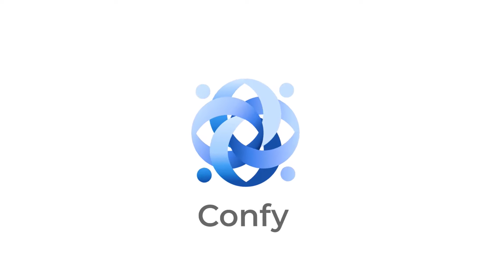

# Confy
---
## SSAFY 12기 508
---
## Description
- Confy는 실시간 회의 요약 및 시각화를 제공하는 서비스입니다. 
- WebRTC를 기반으로 화상회의 기능을 지원하며, STT를 활용한 회의 자동 요약을 제공합니다. 
---
## 영상 포트폴리오

---
### 멤버
- 강명주
- 김예진
- 노영단
- 배석진
- 신유영
- 예세림

## 💫 **프로젝트 초기 세팅 및 실행 방법**
### 🗃️ 필요한 프로젝트
- openvidu-local-deployment : OpenVidu의 기능을 실행하기 위해서 deployment 프로젝트 안의 내용을 Docker로 실행하는 것이 필요하다.
- openvidu-livekit-tutorials : 실제 사용할 튜토리얼 코드. Front랑 Backend 폴더 나눠서 gitLab에 올라가 있다.
- Frontend 폴더 : 리액트로 작성된 프론트엔드 코드
- Backend 폴더: SpringBoot 기반의 백엔드 코드
#### ▶️ 실행 방법
##### ***Docker***

1. **Download OpenVidu (zip 파일 다운로드 후 압축 해제 또는 git clone)**  
[openvidu-local-deployment.zip](https://prod-files-secure.s3.us-west-2.amazonaws.com/6aac2e38-abea-49a5-853b-95050f9e0fc9/e9271368-16f9-4ac7-9809-4b9dad0581ee/openvidu-local-deployment.zip)  
`git clone https://github.com/OpenVidu/openvidu-local-deployment -b 3.0.0`

2. **Configure the local deployment**
Windows는 cmd 창으로 아래 내용 수행 
`cd openvidu-local-deployment/community` 
`.\configure_lan_private_ip_windows.bat`

3. **Run OpenVidu**
`docker compose up`
            
##### ***Frontend***
1. **Visual Studio Code 사용.**
2. **File → Open Forder → Frontend 선택해서 열기**
3. **실행** 
    `npm install` 
    `npm start`
4. **Extensions 설치**
    - Live Server (Five Server)
    - Prettier - Code formatter
##### ***Backend***
1. **Intelij 사용**
2. **실행**
    - src → main → java → com.confy → BasicJavaApplication.java 파일 실행
