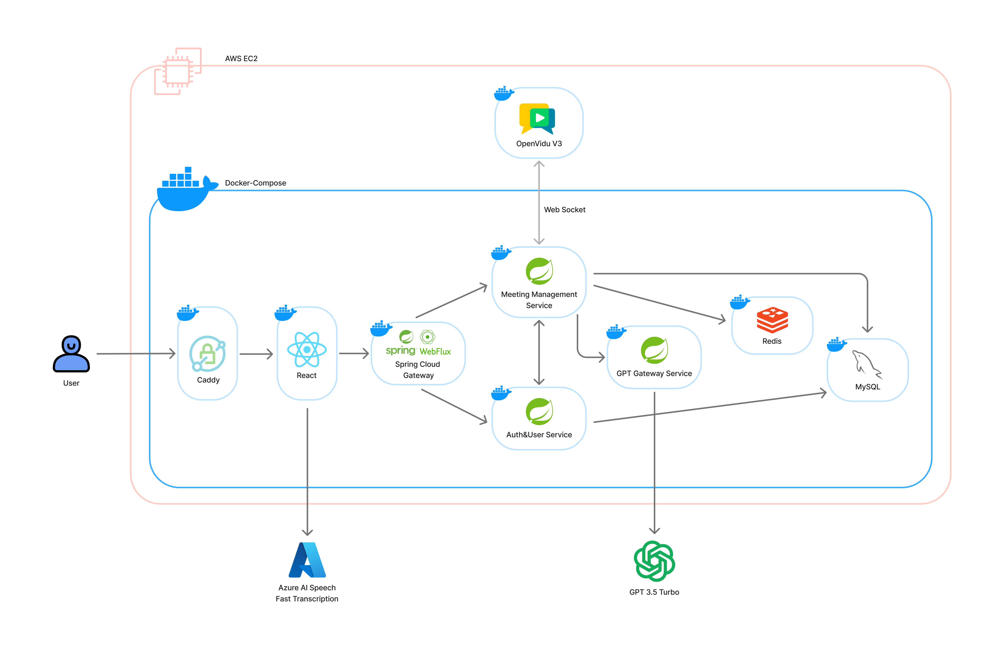

# 회의를 더 스마트하게, Confy 👨‍💻

## 📅 프로젝트 정보

### ✨SSAFY 12기 2학기 공통 프로젝트✨  
📆 **2025.01.06(월) ~ 2025.02.21(금) [7주]**  

**[😎 영상 포트폴리오 바로가기](https://youtu.be/LS8G4rlMbOE)**  

## 📖 주제

**실시간 회의 요약** 및 **시각화** 서비스

- 🎞️ WebRTC를 기반으로 화상회의 기능을 지원
- 📊 STT를 활용한 회의 자동 요약을 제공

## 📝 주요 기능

### ✏️ 실시간 회의 요약

Confy는 **실시간 회의 요약 및 회의 스크립트**를 제공합니다.

 

- 실시간 회의 스크립트

  회의 중 사용자의 발언을 **STT(Speech-to-Text) 기술**로 실시간 변환하여 **회의 스크립트를 자동 생성**하며, 새로운 발언이 추가될 때마다 스크립트가 **자동으로 스크롤**됩니다.

 

- 실시간 회의 요약

  회의 내용을 효율적으로 정리할 수 있도록 **회의 요약**을 지원합니다.
  사용자는 원하는 시간대를 입력하여 **해당 시간의 회의 요약**을 받을 수 있습니다. 5분 전, 10분 전, 30분 전 요약 또는 전체 요약 버튼을 제공하여 사용자의 편의성을 높였습니다. 마크다운 형식의 요약을을 제공합니다.

 

|                  실시간 스크립트                  |                 회의 요약 요청                 |
| :-------------------------------------------: | :--------------------------------------------: |
|  |  |

 

### 🎨 회의 시각화

Confy는 회의 내용을 직관적으로 이해할 수 있도록 **시각화** 기능을 제공합니다.

 

- 회의 스크립트

  회의 중 생성된 **스크립트**와 요약 내용을 바탕으로 **주요 키워드를 태그 형태**로 제공합니다. 이를 통해 회의의 핵심 내용을 빠르게 파악할 수 있습니다.

- 회의 요약 정리

  **회의 요약을 마크다운 형식**으로 정리해줍니다. 내용 조회 및 수정이 가능하여 회의 내용을 손쉽게 수정할 수 있습니다.

- 회의 시각화 조회 및 수정

  사용자는 **텍스트 및 시각화 노드 수정**이 가능하며, **이미지로 저장** 기능으로 효과적인 회의 기록 및 공유가 가능합니다.

 

|                 회의 기록 조회 및 시각화 수정                |
| :----------------------------------------------------: |
|  |

<!-- |                   스크립트 제공                   |                  요약 정리                    |
| :-------------------------------------------: | :------------------------------------------: |
|  |  |

|                  시각화                  |                    시각화 수정                    |
| :-----------------------------------------: | :---------------------------------------------: |
|  |  | -->

 

<!-- ### ✅ 무제

Confy는 **내용**을 지원합니다.

 

|                  무제                  |                 무제                 |
| :-------------------------------------------: | :--------------------------------------------: |
|  |  |

 

### ✏ 무제

Confy는 **내용**를 관리합니다.

- 설명1

    - 세부 설명

    - 세부 설명

- 설명2

   

|                 내용                 |
| :----------------------------------------------------: |
|  |

    -->

## 📌 ERD (Entity-Relationship Diagram)

 

## 🪄 Architecture
본 프로젝트는 마이크로서비스 아키텍처(MSA) 기반으로 설계되었으며, 각 서비스는 독립적으로 운영되면서도 유기적으로 협력하여 전체 시스템을 구성합니다.  
Spring Cloud Gateway를 활용하여 API Gateway를 구성하고, 회원 관리 및 인증 서버, 화상회의 관리 서버, 그리고 GPT 기반의 AI 서비스 서버를 분리하여 관리합니다.

**또한 각각의 서버는 접근 가능한 DB 테이블이 분리되어 있습니다.**
- Auth-User-Group 서버 - users, user_group, notifications, groups DB 테이블에 접근이 가능
- Meeting Management 서버 - summaries, user_meeting, meetings, sentences DB 테이블이 접근이 가능

 

## ⚒️ 기술 스택

### 🖥️ Backend

| Tech Stack      | Description                                                                                                                                                                                                                                |
| :-------------- | :----------------------------------------------------------------------------------------------------------------------------------------------------------------------------------------------------------------------------------------- |
| Framework       |  |
| JDK        |  |
| Build Tool      |  |
| Database        |   |
| Libraries      |    |
| Web Server      |  |
| IDE     |  |

 

### 🖥️ Frontend

| Tech Stack      | Description                                                                                                                                                                                                                                |
| :-------------- | :----------------------------------------------------------------------------------------------------------------------------------------------------------------------------------------------------------------------------------------- |
| Framework        |  |
| Styling        |  |
| Build Tool        |  |
| State Management        |  |
| Libraries        |  |

 

### 🖥️ DevOps / Deployment

| Tech Stack      | Description                                                                                                                                                                                                                                |
| :-------------- | :----------------------------------------------------------------------------------------------------------------------------------------------------------------------------------------------------------------------------------------- |
| Container        |  |
| Server        |  |
| Deployment URL        |  |

 

### 🖥️ Common

|               |                                                                                                                                                                                                                                                                                                                                                                                                                                                                                 |
| :------------ | :------------------------------------------------------------------------------------------------------------------------------------------------------------------------------------------------------------------------------------------------------------------------------------------------------------------------------------------------------------------------------------------------------------------------------------------------------------------------------ |
| Collaboration |    |
| Version Control  |                     |

 

## 🧑🏻 팀원

<table>
    <tr>
      <th scope="col" colspan="4"> Backend </th>
      <th scope="col" colspan="2"> Frontend </th>
    </tr>
    <tr>
      <td>배석진</td>
      <td>김예진</td>
      <td>노영단</td>
      <td>예세림</td>
      <td>강명주</td>
      <td>신유영</td>
    </tr>
    <tr>
      <td>
        
      </td>
      <td>
        
      </td>
      <td>
        
      </td>
      <td>
        
      </td>
      <td>
        
      </td>
      <td>
          
      </td>
    </tr>
</table>

 

<!-- ## 📚 산출물

|                |                                                   |
| :------------: | ------------------------------------------------: |
| File Structure |  | -->
